# Task dependency diagram

Updated: 2026-10-26. Merged baseline: master `6f148dd` (PR #25).
Includes Y06's locally validated delivery, pending review/merge.

[Macro roadmap](plano-de-desenvolvimento.md) | [Job-system plan](plans/jobs.md)

**256 tasks · 596 prerequisite edges · 22 completed · 8 ready · 226 waiting.**

White rectangles wait on prerequisites. Green rectangles are available to select.
Red rectangles are completed; red does **not** mean failure. Choose one ready
task at a time. Y06 is complete locally and awaits review/merge. Y07 is now
ready because both Y05 and Y06 are complete; choose the next task explicitly.

The graphs are split by task family so GitHub can render and readers can inspect
them without a single large canvas. Every task has exactly one primary node.
Cross-family prerequisites appear again as labeled reference rectangles, with the
same status color. An arrow always means **prerequisite -> consumer**. Dependencies
in the owning plans define readiness; graph layout and nearby nodes do not imply
additional ordering. Original task titles retain the approved planning language.

## Available now

```mermaid
flowchart TD
    ready_A06["A06<br/>Tornar includes e unidades de compilação explícitos"]:::ready
    ready_U01["U01<br/>Addon manifest and host extension ADR"]:::ready
    ready_V01["V01<br/>Scheduler contract and design decision"]:::ready
    ready_Y07["Y07<br/>Bootstrap distribution and acceptance"]:::ready
    ready_Y08["Y08<br/>Native compiler and SDK production discovery"]:::ready
    ready_Y10["Y10<br/>Managed SDK and NuGet closure preparation"]:::ready
    ready_Y11["Y11<br/>Python build and tools venv integration"]:::ready
    ready_Z01["Z01<br/>Launcher workspace and action contract"]:::ready
    classDef pending fill:#ffffff,stroke:#6b7280,color:#111827
    classDef ready fill:#86efac,stroke:#166534,color:#111827
    classDef done fill:#f87171,stroke:#991b1b,color:#111827
```

| Task | Authoritative plan | Prerequisites |
| --- | --- | --- |
| **A06** - Tornar includes e unidades de compilação explícitos | [engine](plans/engine.md) | A05 |
| **U01** - Addon manifest and host extension ADR | [addons](plans/addons.md) | Q02, T01 |
| **V01** - Scheduler contract and design decision | [jobs](plans/jobs.md) | Q02, T01 |
| **Y07** - Bootstrap distribution and acceptance | [environment-setup](plans/environment-setup.md) | Y05, Y06 |
| **Y08** - Native compiler and SDK production discovery | [environment-setup](plans/environment-setup.md) | Y04, Q02 |
| **Y10** - Managed SDK and NuGet closure preparation | [environment-setup](plans/environment-setup.md) | Y04, Q05 |
| **Y11** - Python build and tools venv integration | [environment-setup](plans/environment-setup.md) | Y04, Q07 |
| **Z01** - Launcher workspace and action contract | [launcher](plans/launcher.md) | Q02, Y01 |

## Completion evidence

Completed IDs: A01, A02, A03, A04, A05, Q01, Q02, Q05, Q06, Q07, T01, T02, T03, T04, T05, T06, Y01, Y02, Y03, Y04, Y05, Y06.

The merged baseline is grounded in first-parent task merges on master. Y06 is
the current locally validated branch delivery, not a claimed merge. A maintenance
change or a partial reusable slice does not complete a separate task. PR #14
is pytest maintenance rather than a task ID.

| Task | Delivery evidence | Commit or branch |
| --- | --- | --- |
| A01 | [#3](https://github.com/ocarizr/spaceraiders/pull/3) | `bf4bd7c` |
| Q01 | [#4](https://github.com/ocarizr/spaceraiders/pull/4) | `87d9648` |
| A02 | [#5](https://github.com/ocarizr/spaceraiders/pull/5) | `d4dcb66` |
| A03 | [#6](https://github.com/ocarizr/spaceraiders/pull/6) | `6afef78` |
| A04 | [#7](https://github.com/ocarizr/spaceraiders/pull/7) | `9c136ff` |
| A05 | [#8](https://github.com/ocarizr/spaceraiders/pull/8) | `176793e` |
| Q02 | [#9](https://github.com/ocarizr/spaceraiders/pull/9) | `19d7baa` |
| T01 | [#10](https://github.com/ocarizr/spaceraiders/pull/10) | `7b9430d` |
| T02 | [#11](https://github.com/ocarizr/spaceraiders/pull/11) | `3d9bc3e` |
| T03 | [#12](https://github.com/ocarizr/spaceraiders/pull/12) | `87bba9d` |
| T04 | [#13](https://github.com/ocarizr/spaceraiders/pull/13) | `f3d9834` |
| T05 | [#15](https://github.com/ocarizr/spaceraiders/pull/15) | `849b4b8` |
| T06 | [#17](https://github.com/ocarizr/spaceraiders/pull/17) | `f563de4` |
| Q05 | [#18](https://github.com/ocarizr/spaceraiders/pull/18) | `66b1442` |
| Q06 | [#19](https://github.com/ocarizr/spaceraiders/pull/19) | `60a2a09` |
| Q07 | [#20](https://github.com/ocarizr/spaceraiders/pull/20) | `667b838` |
| Y01 | [#21](https://github.com/ocarizr/spaceraiders/pull/21) | `73e8a5f` |
| Y02 | [#22](https://github.com/ocarizr/spaceraiders/pull/22) | `132582e` |
| Y03 | [#23](https://github.com/ocarizr/spaceraiders/pull/23) | `a571e55` |
| Y04 | [#24](https://github.com/ocarizr/spaceraiders/pull/24) | `e7ade58` |
| Y05 | [#25](https://github.com/ocarizr/spaceraiders/pull/25) | `6f148dd` |
| Y06 | 32 managed cases in Release/Debug, 47 contract cases and published headless JSON/schema smoke checks passed; pending review/merge | `Y06_headless_setup_and_doctor` |

## Reading the task families

[A: Legacy stabilization](#a-legacy-stabilization) | [B: Engine extraction](#b-engine-extraction) | [C: World and components](#c-world-and-components) | [D: Rendering](#d-rendering) | [E: Physics](#e-physics) | [F: Asset models and validation](#f-asset-models-and-validation) | [G: Lua runtime and development](#g-lua-runtime-and-development) | [H: Native UI](#h-native-ui) | [I: Cooking and generated data](#i-cooking-and-generated-data) | [J: Shared tooling and native preview](#j-shared-tooling-and-native-preview) | [K: UI editor](#k-ui-editor) | [L: Entity editor](#l-entity-editor) | [M: Sample migration](#m-sample-migration) | [N: Sample gameplay and regression](#n-sample-gameplay-and-regression) | [O: CI and quality](#o-ci-and-quality) | [P: Packaging and release](#p-packaging-and-release) | [Q: Build and package foundations](#q-build-and-package-foundations) | [R: Bundles and providers](#r-bundles-and-providers) | [S: Bundle and memory inspector](#s-bundle-and-memory-inspector) | [T: Observability](#t-observability) | [U: Addons](#u-addons) | [V: Shared job system](#v-shared-job-system) | [W: Level editor](#w-level-editor) | [X: Designer workflow](#x-designer-workflow) | [Y: Environment setup](#y-environment-setup) | [Z: Launcher](#z-launcher)

Primary node titles come from the owning plans. For complete deliverables, file
budgets and acceptance, open the linked plan above each diagram.

### A: Legacy stabilization

Plans: [engine](plans/engine.md).

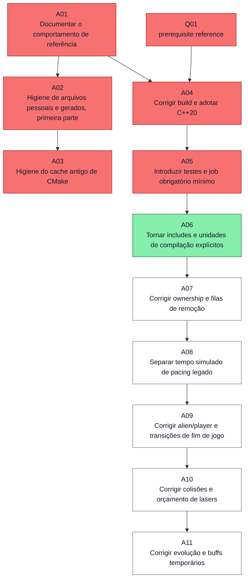
```mermaid
flowchart TD
    ref_A_Q01["Q01<br/>prerequisite reference"]:::done
    A01["A01<br/>Documentar o comportamento de referência"]:::done
    A02["A02<br/>Higiene de arquivos pessoais e gerados, primeira parte"]:::done
    A03["A03<br/>Higiene do cache antigo de CMake"]:::done
    A04["A04<br/>Corrigir build e adotar C++20"]:::done
    A05["A05<br/>Introduzir testes e job obrigatório mínimo"]:::done
    A06["A06<br/>Tornar includes e unidades de compilação explícitos"]:::ready
    A07["A07<br/>Corrigir ownership e filas de remoção"]:::pending
    A08["A08<br/>Separar tempo simulado de pacing legado"]:::pending
    A09["A09<br/>Corrigir alien/player e transições de fim de jogo"]:::pending
    A10["A10<br/>Corrigir colisões e orçamento de lasers"]:::pending
    A11["A11<br/>Corrigir evolução e buffs temporários"]:::pending
    A01 --> A02
    A02 --> A03
    A01 --> A04
    ref_A_Q01 --> A04
    A04 --> A05
    A05 --> A06
    A06 --> A07
    A07 --> A08
    A08 --> A09
    A09 --> A10
    A10 --> A11
    classDef pending fill:#ffffff,stroke:#6b7280,color:#111827
    classDef ready fill:#86efac,stroke:#166534,color:#111827
    classDef done fill:#f87171,stroke:#991b1b,color:#111827
```

### B: Engine extraction

Plans: [engine](plans/engine.md).

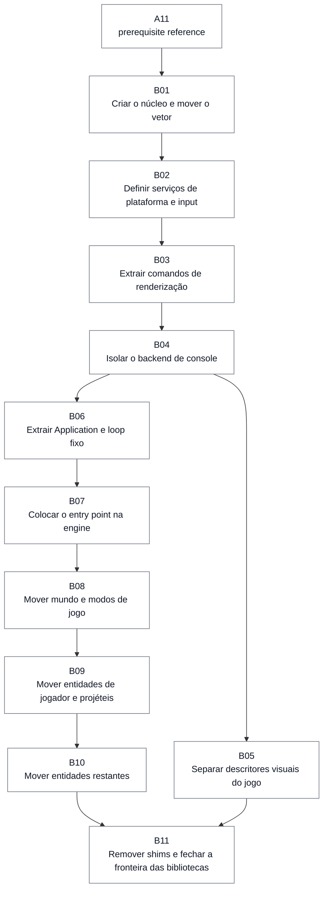
```mermaid
flowchart TD
    ref_B_A11["A11<br/>prerequisite reference"]:::pending
    B01["B01<br/>Criar o núcleo e mover o vetor"]:::pending
    B02["B02<br/>Definir serviços de plataforma e input"]:::pending
    B03["B03<br/>Extrair comandos de renderização"]:::pending
    B04["B04<br/>Isolar o backend de console"]:::pending
    B05["B05<br/>Separar descritores visuais do jogo"]:::pending
    B06["B06<br/>Extrair Application e loop fixo"]:::pending
    B07["B07<br/>Colocar o entry point na engine"]:::pending
    B08["B08<br/>Mover mundo e modos de jogo"]:::pending
    B09["B09<br/>Mover entidades de jogador e projéteis"]:::pending
    B10["B10<br/>Mover entidades restantes"]:::pending
    B11["B11<br/>Remover shims e fechar a fronteira das bibliotecas"]:::pending
    ref_B_A11 --> B01
    B01 --> B02
    B02 --> B03
    B03 --> B04
    B04 --> B05
    B04 --> B06
    B06 --> B07
    B07 --> B08
    B08 --> B09
    B09 --> B10
    B10 --> B11
    B05 --> B11
    classDef pending fill:#ffffff,stroke:#6b7280,color:#111827
    classDef ready fill:#86efac,stroke:#166534,color:#111827
    classDef done fill:#f87171,stroke:#991b1b,color:#111827
```

### C: World and components

Plans: [engine](plans/engine.md).

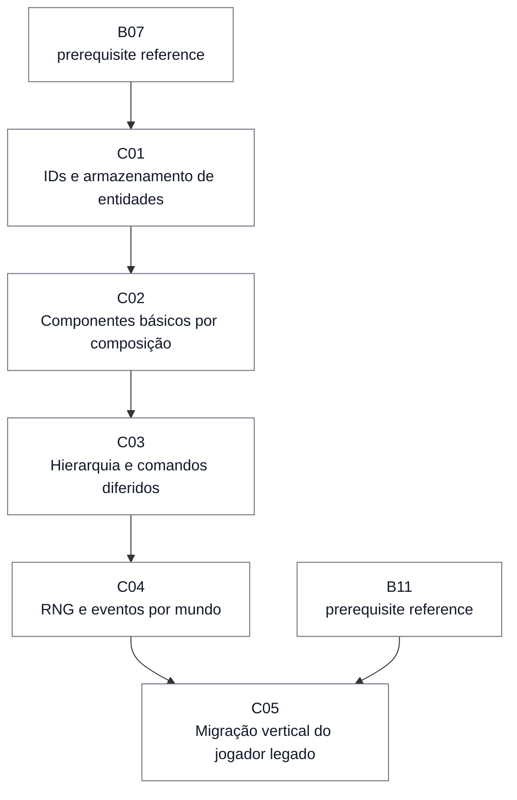
```mermaid
flowchart TD
    ref_C_B07["B07<br/>prerequisite reference"]:::pending
    ref_C_B11["B11<br/>prerequisite reference"]:::pending
    C01["C01<br/>IDs e armazenamento de entidades"]:::pending
    C02["C02<br/>Componentes básicos por composição"]:::pending
    C03["C03<br/>Hierarquia e comandos diferidos"]:::pending
    C04["C04<br/>RNG e eventos por mundo"]:::pending
    C05["C05<br/>Migração vertical do jogador legado"]:::pending
    ref_C_B07 --> C01
    C01 --> C02
    C02 --> C03
    C03 --> C04
    C04 --> C05
    ref_C_B11 --> C05
    classDef pending fill:#ffffff,stroke:#6b7280,color:#111827
    classDef ready fill:#86efac,stroke:#166534,color:#111827
    classDef done fill:#f87171,stroke:#991b1b,color:#111827
```

### D: Rendering

Plans: [engine](plans/engine.md).

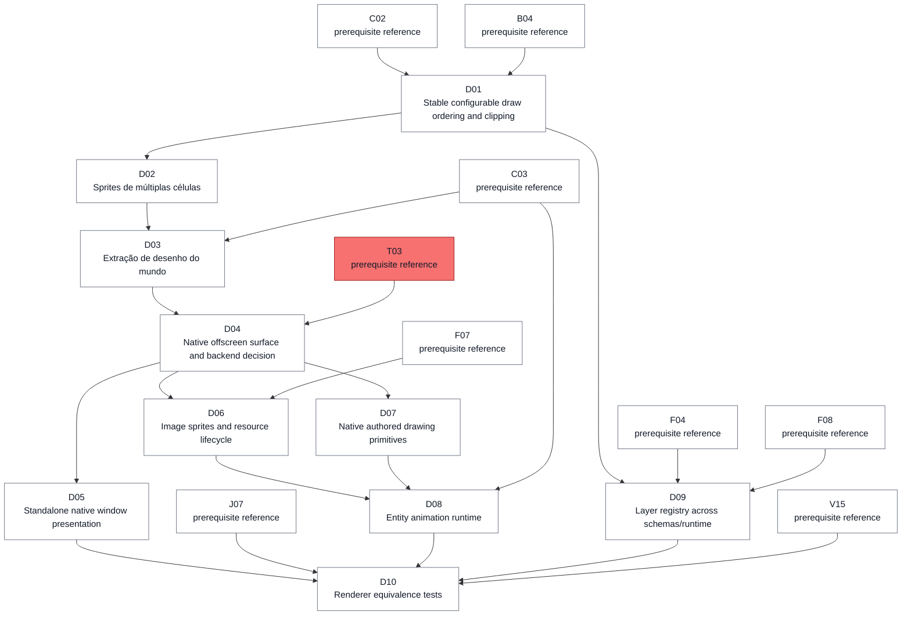
```mermaid
flowchart TD
    ref_D_B04["B04<br/>prerequisite reference"]:::pending
    ref_D_C02["C02<br/>prerequisite reference"]:::pending
    ref_D_C03["C03<br/>prerequisite reference"]:::pending
    ref_D_F04["F04<br/>prerequisite reference"]:::pending
    ref_D_F07["F07<br/>prerequisite reference"]:::pending
    ref_D_F08["F08<br/>prerequisite reference"]:::pending
    ref_D_J07["J07<br/>prerequisite reference"]:::pending
    ref_D_T03["T03<br/>prerequisite reference"]:::done
    ref_D_V15["V15<br/>prerequisite reference"]:::pending
    D01["D01<br/>Stable configurable draw ordering and clipping"]:::pending
    D02["D02<br/>Sprites de múltiplas células"]:::pending
    D03["D03<br/>Extração de desenho do mundo"]:::pending
    D04["D04<br/>Native offscreen surface and backend decision"]:::pending
    D05["D05<br/>Standalone native window presentation"]:::pending
    D06["D06<br/>Image sprites and resource lifecycle"]:::pending
    D07["D07<br/>Native authored drawing primitives"]:::pending
    D08["D08<br/>Entity animation runtime"]:::pending
    D09["D09<br/>Layer registry across schemas/runtime"]:::pending
    D10["D10<br/>Renderer equivalence tests"]:::pending
    ref_D_C02 --> D01
    ref_D_B04 --> D01
    D01 --> D02
    D02 --> D03
    ref_D_C03 --> D03
    D03 --> D04
    ref_D_T03 --> D04
    D04 --> D05
    D04 --> D06
    ref_D_F07 --> D06
    D04 --> D07
    D06 --> D08
    D07 --> D08
    ref_D_C03 --> D08
    D01 --> D09
    ref_D_F04 --> D09
    ref_D_F08 --> D09
    D05 --> D10
    ref_D_J07 --> D10
    D08 --> D10
    D09 --> D10
    ref_D_V15 --> D10
    classDef pending fill:#ffffff,stroke:#6b7280,color:#111827
    classDef ready fill:#86efac,stroke:#166534,color:#111827
    classDef done fill:#f87171,stroke:#991b1b,color:#111827
```

### E: Physics

Plans: [engine](plans/engine.md).

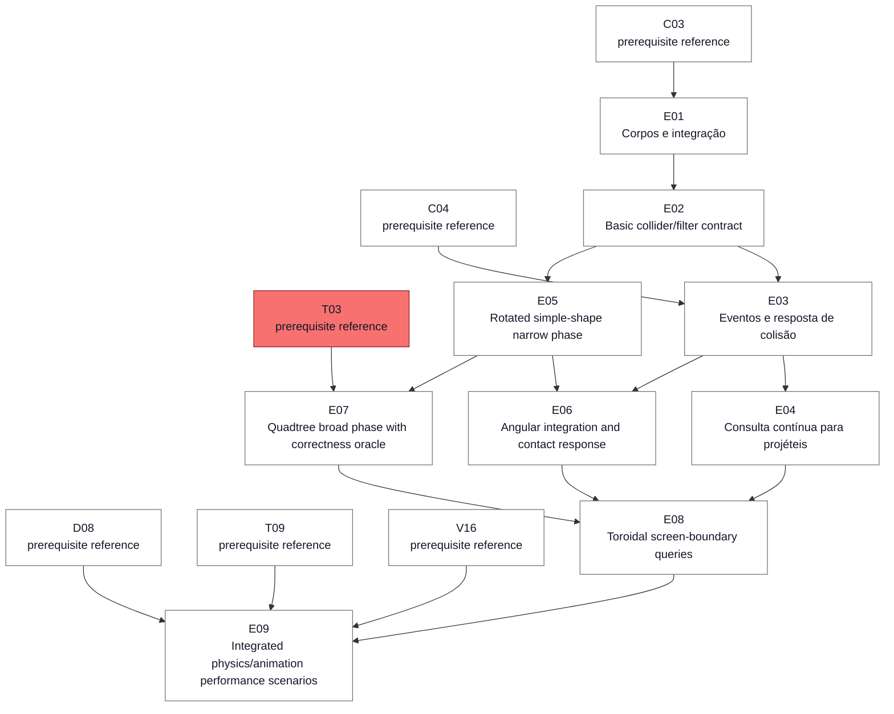
```mermaid
flowchart TD
    ref_E_C03["C03<br/>prerequisite reference"]:::pending
    ref_E_C04["C04<br/>prerequisite reference"]:::pending
    ref_E_D08["D08<br/>prerequisite reference"]:::pending
    ref_E_T03["T03<br/>prerequisite reference"]:::done
    ref_E_T09["T09<br/>prerequisite reference"]:::pending
    ref_E_V16["V16<br/>prerequisite reference"]:::pending
    E01["E01<br/>Corpos e integração"]:::pending
    E02["E02<br/>Basic collider/filter contract"]:::pending
    E03["E03<br/>Eventos e resposta de colisão"]:::pending
    E04["E04<br/>Consulta contínua para projéteis"]:::pending
    E05["E05<br/>Rotated simple-shape narrow phase"]:::pending
    E06["E06<br/>Angular integration and contact response"]:::pending
    E07["E07<br/>Quadtree broad phase with correctness oracle"]:::pending
    E08["E08<br/>Toroidal screen-boundary queries"]:::pending
    E09["E09<br/>Integrated physics/animation performance scenarios"]:::pending
    ref_E_C03 --> E01
    E01 --> E02
    E02 --> E03
    ref_E_C04 --> E03
    E03 --> E04
    E02 --> E05
    E05 --> E06
    E03 --> E06
    E05 --> E07
    ref_E_T03 --> E07
    E06 --> E08
    E07 --> E08
    E04 --> E08
    E08 --> E09
    ref_E_D08 --> E09
    ref_E_T09 --> E09
    ref_E_V16 --> E09
    classDef pending fill:#ffffff,stroke:#6b7280,color:#111827
    classDef ready fill:#86efac,stroke:#166534,color:#111827
    classDef done fill:#f87171,stroke:#991b1b,color:#111827
```

### F: Asset models and validation

Plans: [asset-pipeline](plans/asset-pipeline.md).

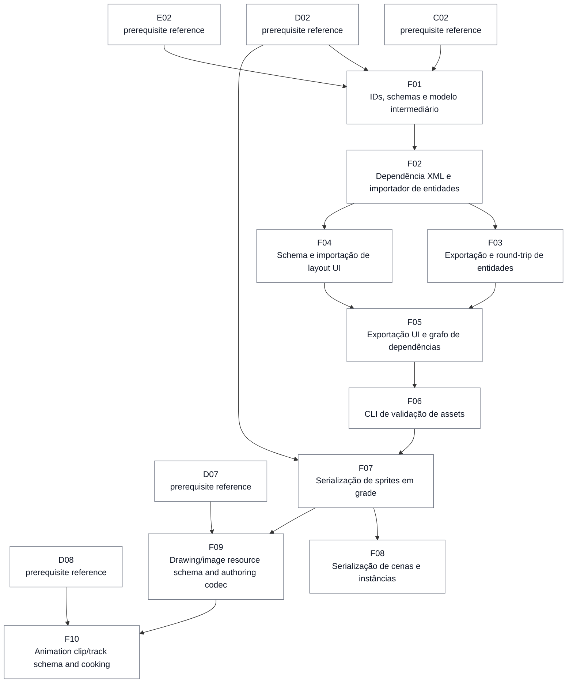
```mermaid
flowchart TD
    ref_F_C02["C02<br/>prerequisite reference"]:::pending
    ref_F_D02["D02<br/>prerequisite reference"]:::pending
    ref_F_D07["D07<br/>prerequisite reference"]:::pending
    ref_F_D08["D08<br/>prerequisite reference"]:::pending
    ref_F_E02["E02<br/>prerequisite reference"]:::pending
    F01["F01<br/>IDs, schemas e modelo intermediário"]:::pending
    F02["F02<br/>Dependência XML e importador de entidades"]:::pending
    F03["F03<br/>Exportação e round-trip de entidades"]:::pending
    F04["F04<br/>Schema e importação de layout UI"]:::pending
    F05["F05<br/>Exportação UI e grafo de dependências"]:::pending
    F06["F06<br/>CLI de validação de assets"]:::pending
    F07["F07<br/>Serialização de sprites em grade"]:::pending
    F08["F08<br/>Serialização de cenas e instâncias"]:::pending
    F09["F09<br/>Drawing/image resource schema and authoring codec"]:::pending
    F10["F10<br/>Animation clip/track schema and cooking"]:::pending
    ref_F_C02 --> F01
    ref_F_D02 --> F01
    ref_F_E02 --> F01
    F01 --> F02
    F02 --> F03
    F02 --> F04
    F03 --> F05
    F04 --> F05
    F05 --> F06
    F06 --> F07
    ref_F_D02 --> F07
    F07 --> F08
    F07 --> F09
    ref_F_D07 --> F09
    F09 --> F10
    ref_F_D08 --> F10
    classDef pending fill:#ffffff,stroke:#6b7280,color:#111827
    classDef ready fill:#86efac,stroke:#166534,color:#111827
    classDef done fill:#f87171,stroke:#991b1b,color:#111827
```

### G: Lua runtime and development

Plans: [scripting](plans/scripting.md).

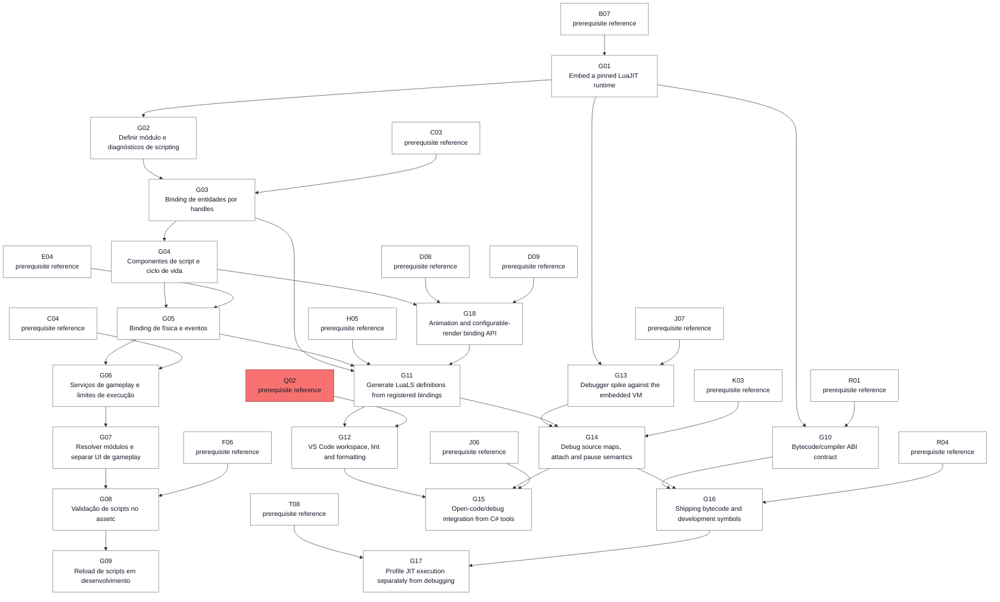
```mermaid
flowchart TD
    ref_G_B07["B07<br/>prerequisite reference"]:::pending
    ref_G_C03["C03<br/>prerequisite reference"]:::pending
    ref_G_C04["C04<br/>prerequisite reference"]:::pending
    ref_G_D08["D08<br/>prerequisite reference"]:::pending
    ref_G_D09["D09<br/>prerequisite reference"]:::pending
    ref_G_E04["E04<br/>prerequisite reference"]:::pending
    ref_G_F06["F06<br/>prerequisite reference"]:::pending
    ref_G_H05["H05<br/>prerequisite reference"]:::pending
    ref_G_J06["J06<br/>prerequisite reference"]:::pending
    ref_G_J07["J07<br/>prerequisite reference"]:::pending
    ref_G_K03["K03<br/>prerequisite reference"]:::pending
    ref_G_Q02["Q02<br/>prerequisite reference"]:::done
    ref_G_R01["R01<br/>prerequisite reference"]:::pending
    ref_G_R04["R04<br/>prerequisite reference"]:::pending
    ref_G_T08["T08<br/>prerequisite reference"]:::pending
    G01["G01<br/>Embed a pinned LuaJIT runtime"]:::pending
    G02["G02<br/>Definir módulo e diagnósticos de scripting"]:::pending
    G03["G03<br/>Binding de entidades por handles"]:::pending
    G04["G04<br/>Componentes de script e ciclo de vida"]:::pending
    G05["G05<br/>Binding de física e eventos"]:::pending
    G06["G06<br/>Serviços de gameplay e limites de execução"]:::pending
    G07["G07<br/>Resolver módulos e separar UI de gameplay"]:::pending
    G08["G08<br/>Validação de scripts no assetc"]:::pending
    G09["G09<br/>Reload de scripts em desenvolvimento"]:::pending
    G10["G10<br/>Bytecode/compiler ABI contract"]:::pending
    G11["G11<br/>Generate LuaLS definitions from registered bindings"]:::pending
    G12["G12<br/>VS Code workspace, lint and formatting"]:::pending
    G13["G13<br/>Debugger spike against the embedded VM"]:::pending
    G14["G14<br/>Debug source maps, attach and pause semantics"]:::pending
    G15["G15<br/>Open-code/debug integration from C# tools"]:::pending
    G16["G16<br/>Shipping bytecode and development symbols"]:::pending
    G17["G17<br/>Profile JIT execution separately from debugging"]:::pending
    G18["G18<br/>Animation and configurable-render binding API"]:::pending
    ref_G_B07 --> G01
    G01 --> G02
    G02 --> G03
    ref_G_C03 --> G03
    G03 --> G04
    G04 --> G05
    ref_G_E04 --> G05
    G05 --> G06
    ref_G_C04 --> G06
    G06 --> G07
    G07 --> G08
    ref_G_F06 --> G08
    G08 --> G09
    G01 --> G10
    ref_G_R01 --> G10
    G03 --> G11
    G05 --> G11
    ref_G_H05 --> G11
    G18 --> G11
    G11 --> G12
    ref_G_Q02 --> G12
    G01 --> G13
    ref_G_J07 --> G13
    G13 --> G14
    G11 --> G14
    ref_G_K03 --> G14
    G12 --> G15
    G14 --> G15
    ref_G_J06 --> G15
    G10 --> G16
    G14 --> G16
    ref_G_R04 --> G16
    ref_G_T08 --> G17
    G16 --> G17
    G04 --> G18
    ref_G_D08 --> G18
    ref_G_D09 --> G18
    classDef pending fill:#ffffff,stroke:#6b7280,color:#111827
    classDef ready fill:#86efac,stroke:#166534,color:#111827
    classDef done fill:#f87171,stroke:#991b1b,color:#111827
```

### H: Native UI

Plans: [engine](plans/engine.md).

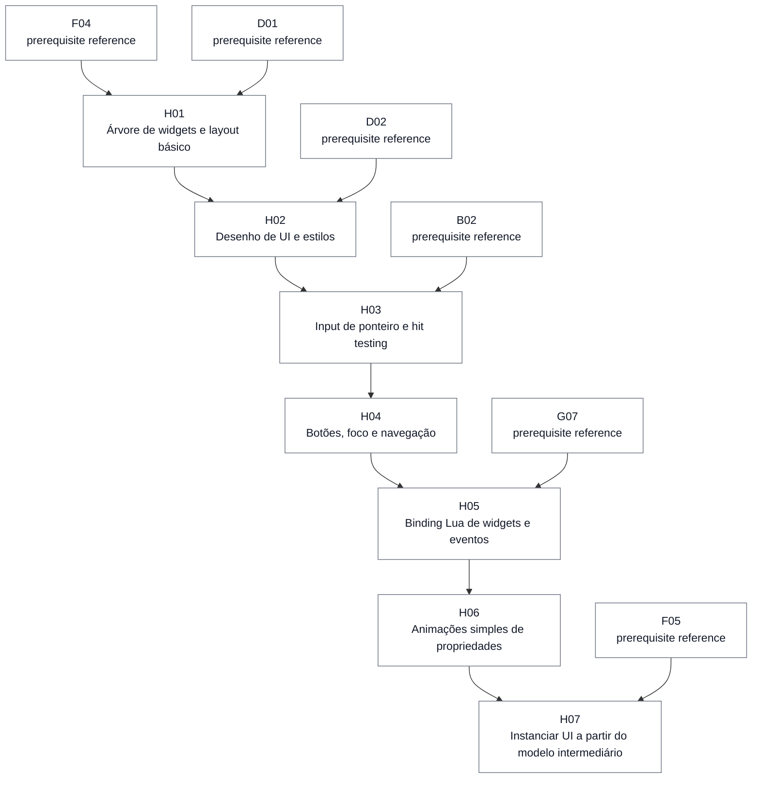
```mermaid
flowchart TD
    ref_H_B02["B02<br/>prerequisite reference"]:::pending
    ref_H_D01["D01<br/>prerequisite reference"]:::pending
    ref_H_D02["D02<br/>prerequisite reference"]:::pending
    ref_H_F04["F04<br/>prerequisite reference"]:::pending
    ref_H_F05["F05<br/>prerequisite reference"]:::pending
    ref_H_G07["G07<br/>prerequisite reference"]:::pending
    H01["H01<br/>Árvore de widgets e layout básico"]:::pending
    H02["H02<br/>Desenho de UI e estilos"]:::pending
    H03["H03<br/>Input de ponteiro e hit testing"]:::pending
    H04["H04<br/>Botões, foco e navegação"]:::pending
    H05["H05<br/>Binding Lua de widgets e eventos"]:::pending
    H06["H06<br/>Animações simples de propriedades"]:::pending
    H07["H07<br/>Instanciar UI a partir do modelo intermediário"]:::pending
    ref_H_F04 --> H01
    ref_H_D01 --> H01
    H01 --> H02
    ref_H_D02 --> H02
    H02 --> H03
    ref_H_B02 --> H03
    H03 --> H04
    H04 --> H05
    ref_H_G07 --> H05
    H05 --> H06
    H06 --> H07
    ref_H_F05 --> H07
    classDef pending fill:#ffffff,stroke:#6b7280,color:#111827
    classDef ready fill:#86efac,stroke:#166534,color:#111827
    classDef done fill:#f87171,stroke:#991b1b,color:#111827
```

### I: Cooking and generated data

Plans: [asset-pipeline](plans/asset-pipeline.md).

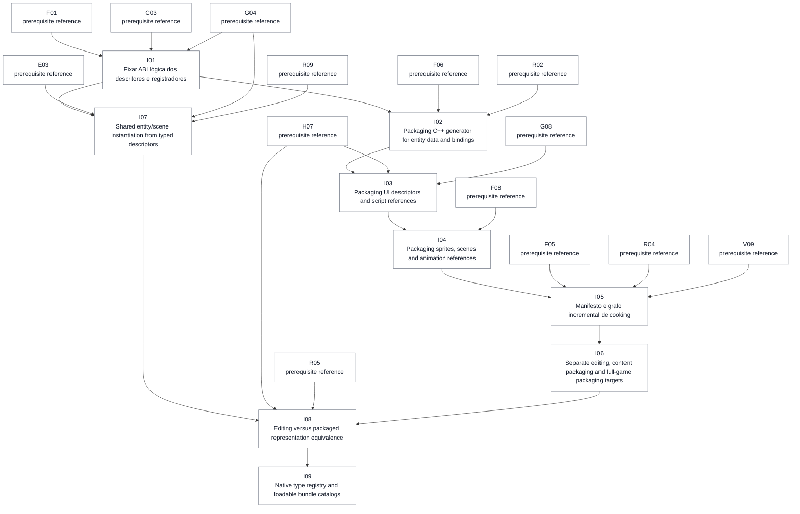
```mermaid
flowchart TD
    ref_I_C03["C03<br/>prerequisite reference"]:::pending
    ref_I_E03["E03<br/>prerequisite reference"]:::pending
    ref_I_F01["F01<br/>prerequisite reference"]:::pending
    ref_I_F05["F05<br/>prerequisite reference"]:::pending
    ref_I_F06["F06<br/>prerequisite reference"]:::pending
    ref_I_F08["F08<br/>prerequisite reference"]:::pending
    ref_I_G04["G04<br/>prerequisite reference"]:::pending
    ref_I_G08["G08<br/>prerequisite reference"]:::pending
    ref_I_H07["H07<br/>prerequisite reference"]:::pending
    ref_I_R02["R02<br/>prerequisite reference"]:::pending
    ref_I_R04["R04<br/>prerequisite reference"]:::pending
    ref_I_R05["R05<br/>prerequisite reference"]:::pending
    ref_I_R09["R09<br/>prerequisite reference"]:::pending
    ref_I_V09["V09<br/>prerequisite reference"]:::pending
    I01["I01<br/>Fixar ABI lógica dos descritores e registradores"]:::pending
    I02["I02<br/>Packaging C++ generator for entity data and bindings"]:::pending
    I03["I03<br/>Packaging UI descriptors and script references"]:::pending
    I04["I04<br/>Packaging sprites, scenes and animation references"]:::pending
    I05["I05<br/>Manifesto e grafo incremental de cooking"]:::pending
    I06["I06<br/>Separate editing, content packaging and full-game packaging targets"]:::pending
    I07["I07<br/>Shared entity/scene instantiation from typed descriptors"]:::pending
    I08["I08<br/>Editing versus packaged representation equivalence"]:::pending
    I09["I09<br/>Native type registry and loadable bundle catalogs"]:::pending
    ref_I_F01 --> I01
    ref_I_C03 --> I01
    ref_I_G04 --> I01
    I01 --> I02
    ref_I_F06 --> I02
    ref_I_R02 --> I02
    I02 --> I03
    ref_I_H07 --> I03
    ref_I_G08 --> I03
    I03 --> I04
    ref_I_F08 --> I04
    I04 --> I05
    ref_I_F05 --> I05
    ref_I_R04 --> I05
    ref_I_V09 --> I05
    I05 --> I06
    I01 --> I07
    ref_I_E03 --> I07
    ref_I_G04 --> I07
    ref_I_R09 --> I07
    I07 --> I08
    ref_I_H07 --> I08
    ref_I_R05 --> I08
    I06 --> I08
    I08 --> I09
    classDef pending fill:#ffffff,stroke:#6b7280,color:#111827
    classDef ready fill:#86efac,stroke:#166534,color:#111827
    classDef done fill:#f87171,stroke:#991b1b,color:#111827
```

### J: Shared tooling and native preview

Plans: [engine](plans/engine.md), [ui-editor](plans/ui-editor.md).

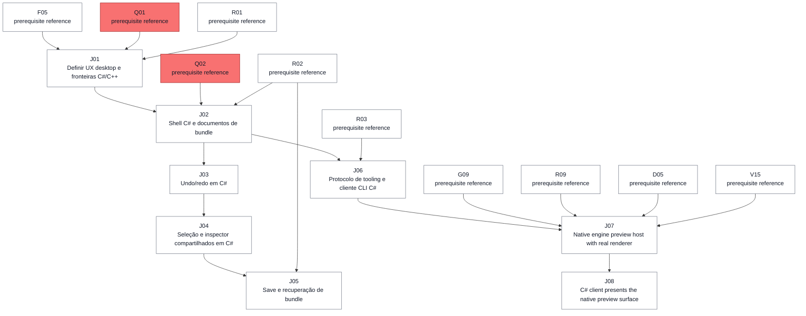
```mermaid
flowchart TD
    ref_J_D05["D05<br/>prerequisite reference"]:::pending
    ref_J_F05["F05<br/>prerequisite reference"]:::pending
    ref_J_G09["G09<br/>prerequisite reference"]:::pending
    ref_J_Q01["Q01<br/>prerequisite reference"]:::done
    ref_J_Q02["Q02<br/>prerequisite reference"]:::done
    ref_J_R01["R01<br/>prerequisite reference"]:::pending
    ref_J_R02["R02<br/>prerequisite reference"]:::pending
    ref_J_R03["R03<br/>prerequisite reference"]:::pending
    ref_J_R09["R09<br/>prerequisite reference"]:::pending
    ref_J_V15["V15<br/>prerequisite reference"]:::pending
    J01["J01<br/>Definir UX desktop e fronteiras C#/C++"]:::pending
    J02["J02<br/>Shell C# e documentos de bundle"]:::pending
    J03["J03<br/>Undo/redo em C#"]:::pending
    J04["J04<br/>Seleção e inspector compartilhados em C#"]:::pending
    J05["J05<br/>Save e recuperação de bundle"]:::pending
    J06["J06<br/>Protocolo de tooling e cliente CLI C#"]:::pending
    J07["J07<br/>Native engine preview host with real renderer"]:::pending
    J08["J08<br/>C# client presents the native preview surface"]:::pending
    ref_J_F05 --> J01
    ref_J_Q01 --> J01
    ref_J_R01 --> J01
    J01 --> J02
    ref_J_Q02 --> J02
    ref_J_R02 --> J02
    J02 --> J03
    J03 --> J04
    J04 --> J05
    ref_J_R02 --> J05
    J02 --> J06
    ref_J_R03 --> J06
    J06 --> J07
    ref_J_G09 --> J07
    ref_J_R09 --> J07
    ref_J_D05 --> J07
    ref_J_V15 --> J07
    J07 --> J08
    classDef pending fill:#ffffff,stroke:#6b7280,color:#111827
    classDef ready fill:#86efac,stroke:#166534,color:#111827
    classDef done fill:#f87171,stroke:#991b1b,color:#111827
```

### K: UI editor

Plans: [ui-editor](plans/ui-editor.md).

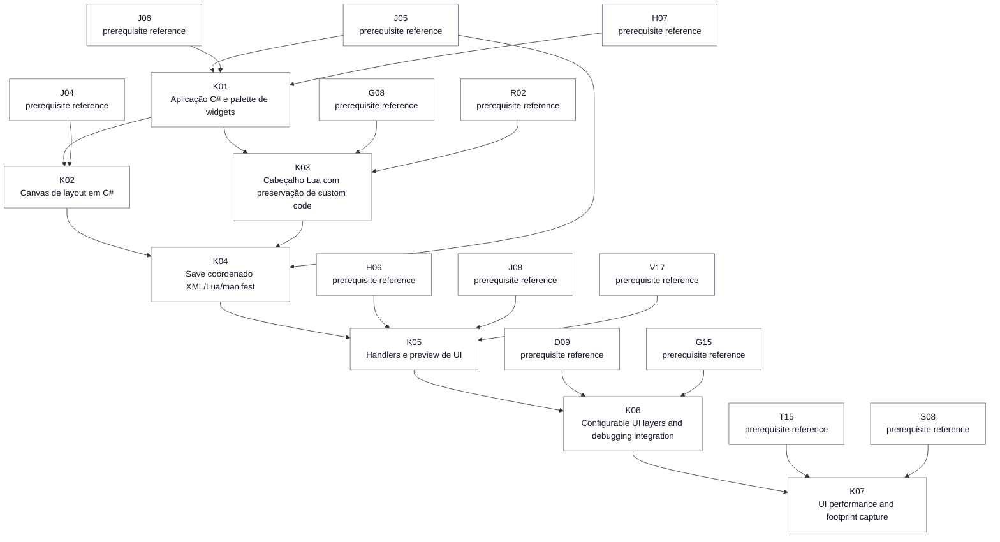
```mermaid
flowchart TD
    ref_K_D09["D09<br/>prerequisite reference"]:::pending
    ref_K_G08["G08<br/>prerequisite reference"]:::pending
    ref_K_G15["G15<br/>prerequisite reference"]:::pending
    ref_K_H06["H06<br/>prerequisite reference"]:::pending
    ref_K_H07["H07<br/>prerequisite reference"]:::pending
    ref_K_J04["J04<br/>prerequisite reference"]:::pending
    ref_K_J05["J05<br/>prerequisite reference"]:::pending
    ref_K_J06["J06<br/>prerequisite reference"]:::pending
    ref_K_J08["J08<br/>prerequisite reference"]:::pending
    ref_K_R02["R02<br/>prerequisite reference"]:::pending
    ref_K_S08["S08<br/>prerequisite reference"]:::pending
    ref_K_T15["T15<br/>prerequisite reference"]:::pending
    ref_K_V17["V17<br/>prerequisite reference"]:::pending
    K01["K01<br/>Aplicação C# e palette de widgets"]:::pending
    K02["K02<br/>Canvas de layout em C#"]:::pending
    K03["K03<br/>Cabeçalho Lua com preservação de custom code"]:::pending
    K04["K04<br/>Save coordenado XML/Lua/manifest"]:::pending
    K05["K05<br/>Handlers e preview de UI"]:::pending
    K06["K06<br/>Configurable UI layers and debugging integration"]:::pending
    K07["K07<br/>UI performance and footprint capture"]:::pending
    ref_K_J05 --> K01
    ref_K_J06 --> K01
    ref_K_H07 --> K01
    K01 --> K02
    ref_K_J04 --> K02
    K01 --> K03
    ref_K_G08 --> K03
    ref_K_R02 --> K03
    K02 --> K04
    K03 --> K04
    ref_K_J05 --> K04
    K04 --> K05
    ref_K_H06 --> K05
    ref_K_J08 --> K05
    ref_K_V17 --> K05
    K05 --> K06
    ref_K_D09 --> K06
    ref_K_G15 --> K06
    K06 --> K07
    ref_K_T15 --> K07
    ref_K_S08 --> K07
    classDef pending fill:#ffffff,stroke:#6b7280,color:#111827
    classDef ready fill:#86efac,stroke:#166534,color:#111827
    classDef done fill:#f87171,stroke:#991b1b,color:#111827
```

### L: Entity editor

Plans: [entity-editor](plans/entity-editor.md).

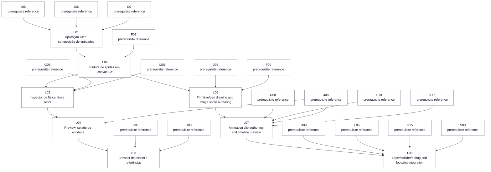
```mermaid
flowchart TD
    ref_L_D07["D07<br/>prerequisite reference"]:::pending
    ref_L_D08["D08<br/>prerequisite reference"]:::pending
    ref_L_D09["D09<br/>prerequisite reference"]:::pending
    ref_L_E05["E05<br/>prerequisite reference"]:::pending
    ref_L_F07["F07<br/>prerequisite reference"]:::pending
    ref_L_F09["F09<br/>prerequisite reference"]:::pending
    ref_L_F10["F10<br/>prerequisite reference"]:::pending
    ref_L_G05["G05<br/>prerequisite reference"]:::pending
    ref_L_G15["G15<br/>prerequisite reference"]:::pending
    ref_L_I07["I07<br/>prerequisite reference"]:::pending
    ref_L_J05["J05<br/>prerequisite reference"]:::pending
    ref_L_J06["J06<br/>prerequisite reference"]:::pending
    ref_L_J08["J08<br/>prerequisite reference"]:::pending
    ref_L_K05["K05<br/>prerequisite reference"]:::pending
    ref_L_M01["M01<br/>prerequisite reference"]:::pending
    ref_L_R03["R03<br/>prerequisite reference"]:::pending
    ref_L_S08["S08<br/>prerequisite reference"]:::pending
    ref_L_V17["V17<br/>prerequisite reference"]:::pending
    L01["L01<br/>Aplicação C# e composição de entidades"]:::pending
    L02["L02<br/>Pintura de sprites em canvas C#"]:::pending
    L03["L03<br/>Inspector de física, tiro e script"]:::pending
    L04["L04<br/>Preview isolado de entidade"]:::pending
    L05["L05<br/>Browser de assets e referências"]:::pending
    L06["L06<br/>Primitive/pen drawing and image sprite authoring"]:::pending
    L07["L07<br/>Animation clip authoring and timeline preview"]:::pending
    L08["L08<br/>Layer/collider/debug and footprint integration"]:::pending
    ref_L_J05 --> L01
    ref_L_J06 --> L01
    ref_L_I07 --> L01
    L01 --> L02
    ref_L_F07 --> L02
    L02 --> L03
    ref_L_G05 --> L03
    ref_L_M01 --> L03
    L03 --> L04
    ref_L_J08 --> L04
    L04 --> L05
    ref_L_K05 --> L05
    ref_L_R03 --> L05
    L02 --> L06
    ref_L_D07 --> L06
    ref_L_F09 --> L06
    L06 --> L07
    ref_L_D08 --> L07
    ref_L_F10 --> L07
    ref_L_J08 --> L07
    ref_L_V17 --> L07
    L07 --> L08
    ref_L_D09 --> L08
    ref_L_E05 --> L08
    ref_L_G15 --> L08
    ref_L_S08 --> L08
    classDef pending fill:#ffffff,stroke:#6b7280,color:#111827
    classDef ready fill:#86efac,stroke:#166534,color:#111827
    classDef done fill:#f87171,stroke:#991b1b,color:#111827
```

### M: Sample migration

Plans: [sample-game](plans/sample-game.md).

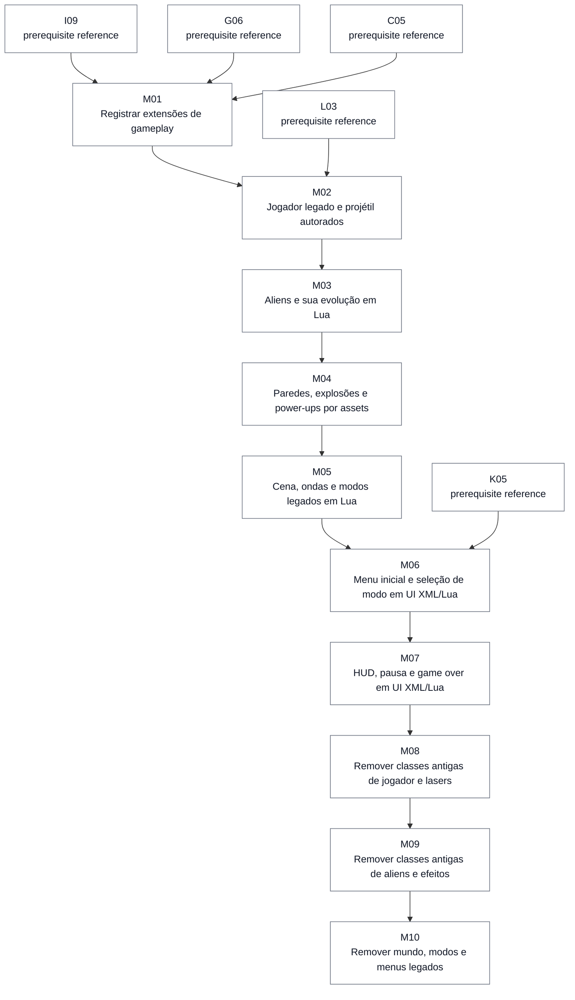
```mermaid
flowchart TD
    ref_M_C05["C05<br/>prerequisite reference"]:::pending
    ref_M_G06["G06<br/>prerequisite reference"]:::pending
    ref_M_I09["I09<br/>prerequisite reference"]:::pending
    ref_M_K05["K05<br/>prerequisite reference"]:::pending
    ref_M_L03["L03<br/>prerequisite reference"]:::pending
    M01["M01<br/>Registrar extensões de gameplay"]:::pending
    M02["M02<br/>Jogador legado e projétil autorados"]:::pending
    M03["M03<br/>Aliens e sua evolução em Lua"]:::pending
    M04["M04<br/>Paredes, explosões e power-ups por assets"]:::pending
    M05["M05<br/>Cena, ondas e modos legados em Lua"]:::pending
    M06["M06<br/>Menu inicial e seleção de modo em UI XML/Lua"]:::pending
    M07["M07<br/>HUD, pausa e game over em UI XML/Lua"]:::pending
    M08["M08<br/>Remover classes antigas de jogador e lasers"]:::pending
    M09["M09<br/>Remover classes antigas de aliens e efeitos"]:::pending
    M10["M10<br/>Remover mundo, modos e menus legados"]:::pending
    ref_M_I09 --> M01
    ref_M_G06 --> M01
    ref_M_C05 --> M01
    M01 --> M02
    ref_M_L03 --> M02
    M02 --> M03
    M03 --> M04
    M04 --> M05
    M05 --> M06
    ref_M_K05 --> M06
    M06 --> M07
    M07 --> M08
    M08 --> M09
    M09 --> M10
    classDef pending fill:#ffffff,stroke:#6b7280,color:#111827
    classDef ready fill:#86efac,stroke:#166534,color:#111827
    classDef done fill:#f87171,stroke:#991b1b,color:#111827
```

### N: Sample gameplay and regression

Plans: [sample-game](plans/sample-game.md).

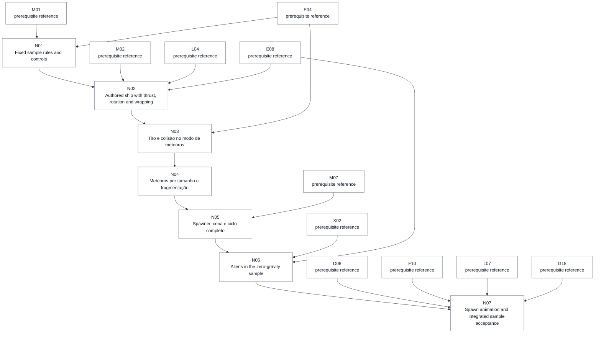
```mermaid
flowchart TD
    ref_N_D08["D08<br/>prerequisite reference"]:::pending
    ref_N_E04["E04<br/>prerequisite reference"]:::pending
    ref_N_E08["E08<br/>prerequisite reference"]:::pending
    ref_N_F10["F10<br/>prerequisite reference"]:::pending
    ref_N_G18["G18<br/>prerequisite reference"]:::pending
    ref_N_L04["L04<br/>prerequisite reference"]:::pending
    ref_N_L07["L07<br/>prerequisite reference"]:::pending
    ref_N_M01["M01<br/>prerequisite reference"]:::pending
    ref_N_M02["M02<br/>prerequisite reference"]:::pending
    ref_N_M07["M07<br/>prerequisite reference"]:::pending
    ref_N_X02["X02<br/>prerequisite reference"]:::pending
    N01["N01<br/>Fixed sample rules and controls"]:::pending
    N02["N02<br/>Authored ship with thrust, rotation and wrapping"]:::pending
    N03["N03<br/>Tiro e colisão no modo de meteoros"]:::pending
    N04["N04<br/>Meteoros por tamanho e fragmentação"]:::pending
    N05["N05<br/>Spawner, cena e ciclo completo"]:::pending
    N06["N06<br/>Aliens in the zero-gravity sample"]:::pending
    N07["N07<br/>Spawn animation and integrated sample acceptance"]:::pending
    ref_N_M01 --> N01
    ref_N_E04 --> N01
    N01 --> N02
    ref_N_M02 --> N02
    ref_N_L04 --> N02
    ref_N_E08 --> N02
    N02 --> N03
    ref_N_E04 --> N03
    N03 --> N04
    N04 --> N05
    ref_N_M07 --> N05
    N05 --> N06
    ref_N_X02 --> N06
    ref_N_E08 --> N06
    N06 --> N07
    ref_N_D08 --> N07
    ref_N_F10 --> N07
    ref_N_L07 --> N07
    ref_N_G18 --> N07
    classDef pending fill:#ffffff,stroke:#6b7280,color:#111827
    classDef ready fill:#86efac,stroke:#166534,color:#111827
    classDef done fill:#f87171,stroke:#991b1b,color:#111827
```

### O: CI and quality

Plans: [asset-pipeline](plans/asset-pipeline.md).

```mermaid
flowchart TD
    ref_O_A05["A05<br/>prerequisite reference"]:::done
    ref_O_B07["B07<br/>prerequisite reference"]:::pending
    ref_O_B11["B11<br/>prerequisite reference"]:::pending
    ref_O_C03["C03<br/>prerequisite reference"]:::pending
    ref_O_D04["D04<br/>prerequisite reference"]:::pending
    ref_O_G08["G08<br/>prerequisite reference"]:::pending
    ref_O_G12["G12<br/>prerequisite reference"]:::pending
    ref_O_G16["G16<br/>prerequisite reference"]:::pending
    ref_O_I08["I08<br/>prerequisite reference"]:::pending
    ref_O_K05["K05<br/>prerequisite reference"]:::pending
    ref_O_L04["L04<br/>prerequisite reference"]:::pending
    ref_O_L05["L05<br/>prerequisite reference"]:::pending
    ref_O_N05["N05<br/>prerequisite reference"]:::pending
    ref_O_P03["P03<br/>prerequisite reference"]:::pending
    ref_O_Q04["Q04<br/>prerequisite reference"]:::pending
    ref_O_S04["S04<br/>prerequisite reference"]:::pending
    ref_O_T05["T05<br/>prerequisite reference"]:::done
    ref_O_T06["T06<br/>prerequisite reference"]:::done
    ref_O_V12["V12<br/>prerequisite reference"]:::pending
    ref_O_V14["V14<br/>prerequisite reference"]:::pending
    ref_O_V19["V19<br/>prerequisite reference"]:::pending
    ref_O_X03["X03<br/>prerequisite reference"]:::pending
    O01["O01<br/>Classificação de impacto e gate único"]:::pending
    O02["O02<br/>Jobs de runtime/jogo e matriz enxuta"]:::pending
    O03["O03<br/>Jobs seletivos de assets, Lua e ferramentas C#"]:::pending
    O04["O04<br/>Checagens estáticas e diagnósticos de memória"]:::pending
    O05["O05<br/>Testes do fluxo real de autoria e distribuição"]:::pending
    O06["O06<br/>Desempenho medido e orçamento simples"]:::pending
    O07["O07<br/>Selective CI for diagnostics and shared surfaces"]:::pending
    O08["O08<br/>Lua IDE/bytecode and tools-only pipeline checks"]:::pending
    ref_O_A05 --> O01
    ref_O_B07 --> O01
    O01 --> O02
    ref_O_B11 --> O02
    O02 --> O03
    ref_O_G08 --> O03
    ref_O_I08 --> O03
    ref_O_L04 --> O03
    ref_O_S04 --> O03
    ref_O_Q04 --> O03
    O02 --> O04
    ref_O_C03 --> O04
    O03 --> O05
    ref_O_K05 --> O05
    ref_O_L05 --> O05
    ref_O_P03 --> O05
    ref_O_N05 --> O06
    ref_O_P03 --> O06
    ref_O_V19 --> O06
    O03 --> O07
    ref_O_T05 --> O07
    ref_O_T06 --> O07
    ref_O_D04 --> O07
    ref_O_V12 --> O07
    ref_O_V14 --> O07
    O07 --> O08
    ref_O_G12 --> O08
    ref_O_G16 --> O08
    ref_O_X03 --> O08
    classDef pending fill:#ffffff,stroke:#6b7280,color:#111827
    classDef ready fill:#86efac,stroke:#166534,color:#111827
    classDef done fill:#f87171,stroke:#991b1b,color:#111827
```

### P: Packaging and release

Plans: [asset-pipeline](plans/asset-pipeline.md).

```mermaid
flowchart TD
    ref_P_G08["G08<br/>prerequisite reference"]:::pending
    ref_P_G17["G17<br/>prerequisite reference"]:::pending
    ref_P_I09["I09<br/>prerequisite reference"]:::pending
    ref_P_J08["J08<br/>prerequisite reference"]:::pending
    ref_P_K07["K07<br/>prerequisite reference"]:::pending
    ref_P_L08["L08<br/>prerequisite reference"]:::pending
    ref_P_M07["M07<br/>prerequisite reference"]:::pending
    ref_P_N05["N05<br/>prerequisite reference"]:::pending
    ref_P_N07["N07<br/>prerequisite reference"]:::pending
    ref_P_O03["O03<br/>prerequisite reference"]:::pending
    ref_P_O05["O05<br/>prerequisite reference"]:::pending
    ref_P_O06["O06<br/>prerequisite reference"]:::pending
    ref_P_Q03["Q03<br/>prerequisite reference"]:::pending
    ref_P_R06["R06<br/>prerequisite reference"]:::pending
    ref_P_R07["R07<br/>prerequisite reference"]:::pending
    ref_P_R09["R09<br/>prerequisite reference"]:::pending
    ref_P_S06["S06<br/>prerequisite reference"]:::pending
    ref_P_S11["S11<br/>prerequisite reference"]:::pending
    ref_P_T14["T14<br/>prerequisite reference"]:::pending
    ref_P_U14["U14<br/>prerequisite reference"]:::pending
    ref_P_W01["W01<br/>prerequisite reference"]:::pending
    ref_P_W06["W06<br/>prerequisite reference"]:::pending
    ref_P_X03["X03<br/>prerequisite reference"]:::pending
    ref_P_X07["X07<br/>prerequisite reference"]:::pending
    ref_P_Y14["Y14<br/>prerequisite reference"]:::pending
    ref_P_Z09["Z09<br/>prerequisite reference"]:::pending
    P01["P01<br/>Development source-data and Shipping binary profiles"]:::pending
    P02["P02<br/>Install e conteúdo do pacote"]:::pending
    P03["P03<br/>Smoke do pacote fora da árvore de fontes"]:::pending
    P04["P04<br/>Empacotamento versionado"]:::pending
    P05["P05<br/>Workflow de release"]:::pending
    P06["P06<br/>Guia de desenvolvimento e entrega final"]:::pending
    P07["P07<br/>Independent binary Designer SDK distribution"]:::pending
    ref_P_I09 --> P01
    ref_P_G08 --> P01
    ref_P_R06 --> P01
    ref_P_R09 --> P01
    P01 --> P02
    ref_P_M07 --> P02
    P02 --> P03
    ref_P_N05 --> P03
    P03 --> P04
    P04 --> P05
    ref_P_O03 --> P05
    P07 --> P05
    ref_P_O05 --> P06
    ref_P_O06 --> P06
    P05 --> P06
    ref_P_S11 --> P06
    ref_P_R07 --> P06
    ref_P_Q03 --> P06
    ref_P_W06 --> P06
    ref_P_T14 --> P06
    ref_P_G17 --> P06
    ref_P_N07 --> P06
    ref_P_L08 --> P06
    ref_P_K07 --> P06
    ref_P_X07 --> P06
    ref_P_U14 --> P06
    ref_P_Z09 --> P06
    ref_P_Y14 --> P06
    ref_P_J08 --> P07
    ref_P_S06 --> P07
    ref_P_Q03 --> P07
    ref_P_W01 --> P07
    ref_P_X03 --> P07
    classDef pending fill:#ffffff,stroke:#6b7280,color:#111827
    classDef ready fill:#86efac,stroke:#166534,color:#111827
    classDef done fill:#f87171,stroke:#991b1b,color:#111827
```

### Q: Build and package foundations

Plans: [asset-pipeline](plans/asset-pipeline.md).

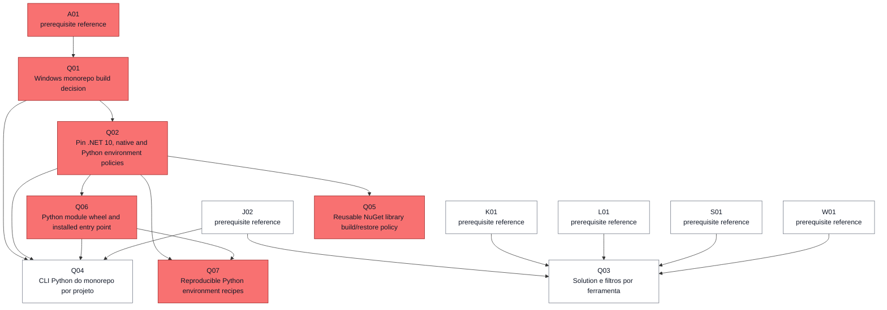
```mermaid
flowchart TD
    ref_Q_A01["A01<br/>prerequisite reference"]:::done
    ref_Q_J02["J02<br/>prerequisite reference"]:::pending
    ref_Q_K01["K01<br/>prerequisite reference"]:::pending
    ref_Q_L01["L01<br/>prerequisite reference"]:::pending
    ref_Q_S01["S01<br/>prerequisite reference"]:::pending
    ref_Q_W01["W01<br/>prerequisite reference"]:::pending
    Q01["Q01<br/>Windows monorepo build decision"]:::done
    Q02["Q02<br/>Pin .NET 10, native and Python environment policies"]:::done
    Q03["Q03<br/>Solution e filtros por ferramenta"]:::pending
    Q04["Q04<br/>CLI Python do monorepo por projeto"]:::pending
    Q05["Q05<br/>Reusable NuGet library build/restore policy"]:::done
    Q06["Q06<br/>Python module wheel and installed entry point"]:::done
    Q07["Q07<br/>Reproducible Python environment recipes"]:::done
    ref_Q_A01 --> Q01
    Q01 --> Q02
    ref_Q_J02 --> Q03
    ref_Q_K01 --> Q03
    ref_Q_L01 --> Q03
    ref_Q_S01 --> Q03
    ref_Q_W01 --> Q03
    Q01 --> Q04
    Q02 --> Q04
    Q06 --> Q04
    ref_Q_J02 --> Q04
    Q02 --> Q05
    Q02 --> Q06
    Q02 --> Q07
    Q06 --> Q07
    classDef pending fill:#ffffff,stroke:#6b7280,color:#111827
    classDef ready fill:#86efac,stroke:#166534,color:#111827
    classDef done fill:#f87171,stroke:#991b1b,color:#111827
```

### R: Bundles and providers

Plans: [asset-pipeline](plans/asset-pipeline.md).

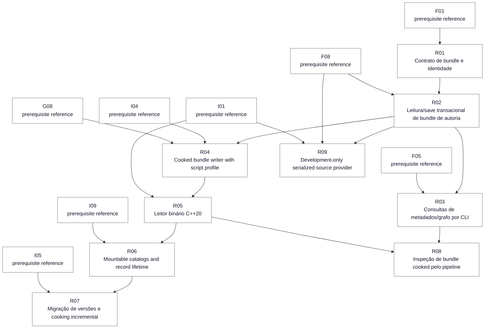
```mermaid
flowchart TD
    ref_R_F01["F01<br/>prerequisite reference"]:::pending
    ref_R_F05["F05<br/>prerequisite reference"]:::pending
    ref_R_F08["F08<br/>prerequisite reference"]:::pending
    ref_R_G08["G08<br/>prerequisite reference"]:::pending
    ref_R_I01["I01<br/>prerequisite reference"]:::pending
    ref_R_I04["I04<br/>prerequisite reference"]:::pending
    ref_R_I05["I05<br/>prerequisite reference"]:::pending
    ref_R_I09["I09<br/>prerequisite reference"]:::pending
    R01["R01<br/>Contrato de bundle e identidade"]:::pending
    R02["R02<br/>Leitura/save transacional de bundle de autoria"]:::pending
    R03["R03<br/>Consultas de metadados/grafo por CLI"]:::pending
    R04["R04<br/>Cooked bundle writer with script profile"]:::pending
    R05["R05<br/>Leitor binário C++20"]:::pending
    R06["R06<br/>Mountable catalogs and record lifetime"]:::pending
    R07["R07<br/>Migração de versões e cooking incremental"]:::pending
    R08["R08<br/>Inspeção de bundle cooked pelo pipeline"]:::pending
    R09["R09<br/>Development-only serialized source provider"]:::pending
    ref_R_F01 --> R01
    R01 --> R02
    ref_R_F08 --> R02
    R02 --> R03
    ref_R_F05 --> R03
    R02 --> R04
    ref_R_I04 --> R04
    ref_R_G08 --> R04
    R04 --> R05
    ref_R_I01 --> R05
    R05 --> R06
    ref_R_I09 --> R06
    R06 --> R07
    ref_R_I05 --> R07
    R03 --> R08
    R05 --> R08
    R02 --> R09
    ref_R_F08 --> R09
    ref_R_I01 --> R09
    classDef pending fill:#ffffff,stroke:#6b7280,color:#111827
    classDef ready fill:#86efac,stroke:#166534,color:#111827
    classDef done fill:#f87171,stroke:#991b1b,color:#111827
```

### S: Bundle and memory inspector

Plans: [bundle-inspector](plans/bundle-inspector.md).

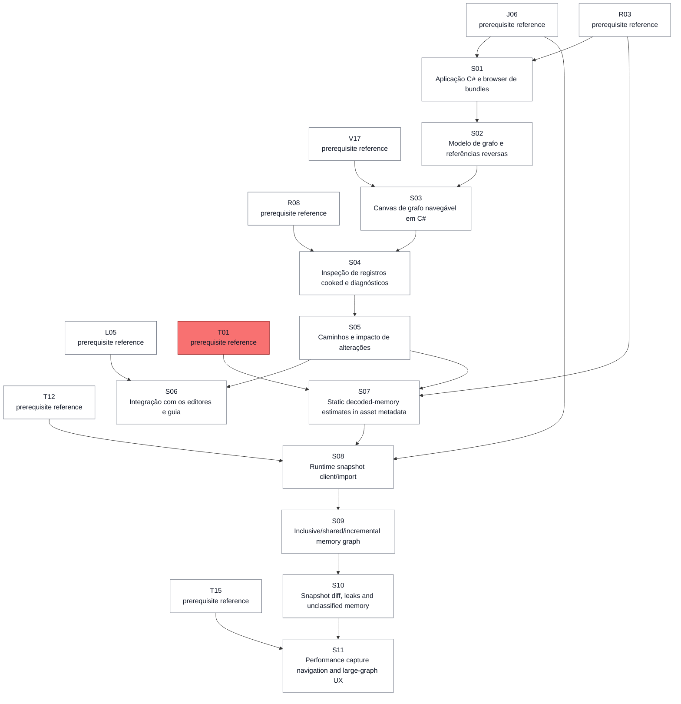
```mermaid
flowchart TD
    ref_S_J06["J06<br/>prerequisite reference"]:::pending
    ref_S_L05["L05<br/>prerequisite reference"]:::pending
    ref_S_R03["R03<br/>prerequisite reference"]:::pending
    ref_S_R08["R08<br/>prerequisite reference"]:::pending
    ref_S_T01["T01<br/>prerequisite reference"]:::done
    ref_S_T12["T12<br/>prerequisite reference"]:::pending
    ref_S_T15["T15<br/>prerequisite reference"]:::pending
    ref_S_V17["V17<br/>prerequisite reference"]:::pending
    S01["S01<br/>Aplicação C# e browser de bundles"]:::pending
    S02["S02<br/>Modelo de grafo e referências reversas"]:::pending
    S03["S03<br/>Canvas de grafo navegável em C#"]:::pending
    S04["S04<br/>Inspeção de registros cooked e diagnósticos"]:::pending
    S05["S05<br/>Caminhos e impacto de alterações"]:::pending
    S06["S06<br/>Integração com os editores e guia"]:::pending
    S07["S07<br/>Static decoded-memory estimates in asset metadata"]:::pending
    S08["S08<br/>Runtime snapshot client/import"]:::pending
    S09["S09<br/>Inclusive/shared/incremental memory graph"]:::pending
    S10["S10<br/>Snapshot diff, leaks and unclassified memory"]:::pending
    S11["S11<br/>Performance capture navigation and large-graph UX"]:::pending
    ref_S_J06 --> S01
    ref_S_R03 --> S01
    S01 --> S02
    S02 --> S03
    ref_S_V17 --> S03
    S03 --> S04
    ref_S_R08 --> S04
    S04 --> S05
    S05 --> S06
    ref_S_L05 --> S06
    S05 --> S07
    ref_S_T01 --> S07
    ref_S_R03 --> S07
    S07 --> S08
    ref_S_T12 --> S08
    ref_S_J06 --> S08
    S08 --> S09
    S09 --> S10
    S10 --> S11
    ref_S_T15 --> S11
    classDef pending fill:#ffffff,stroke:#6b7280,color:#111827
    classDef ready fill:#86efac,stroke:#166534,color:#111827
    classDef done fill:#f87171,stroke:#991b1b,color:#111827
```

### T: Observability

Plans: [observability](plans/observability.md).

```mermaid
flowchart TD
    ref_T_A04["A04<br/>prerequisite reference"]:::done
    ref_T_B07["B07<br/>prerequisite reference"]:::pending
    ref_T_C02["C02<br/>prerequisite reference"]:::pending
    ref_T_G01["G01<br/>prerequisite reference"]:::pending
    ref_T_G04["G04<br/>prerequisite reference"]:::pending
    ref_T_J06["J06<br/>prerequisite reference"]:::pending
    ref_T_J07["J07<br/>prerequisite reference"]:::pending
    ref_T_O03["O03<br/>prerequisite reference"]:::pending
    ref_T_Q01["Q01<br/>prerequisite reference"]:::done
    ref_T_Q02["Q02<br/>prerequisite reference"]:::done
    ref_T_R06["R06<br/>prerequisite reference"]:::pending
    ref_T_S01["S01<br/>prerequisite reference"]:::pending
    ref_T_V15["V15<br/>prerequisite reference"]:::pending
    ref_T_V17["V17<br/>prerequisite reference"]:::pending
    ref_T_V18["V18<br/>prerequisite reference"]:::pending
    ref_T_V19["V19<br/>prerequisite reference"]:::pending
    ref_T_W01["W01<br/>prerequisite reference"]:::pending
    ref_T_Y04["Y04<br/>prerequisite reference"]:::done
    T01["T01<br/>Shared telemetry schemas and cost terminology"]:::done
    T02["T02<br/>Native logging API with spdlog"]:::done
    T03["T03<br/>Optional native profiling scopes"]:::done
    T04["T04<br/>Chrome JSON trace writer and capture sessions"]:::done
    T05["T05<br/>C# logging and profiling adapter"]:::done
    T06["T06<br/>Python pipeline telemetry adapter"]:::done
    T07["T07<br/>Instrument native execution and preview"]:::pending
    T08["T08<br/>Lua callback/module profiling bridge"]:::pending
    T09["T09<br/>Native tagged memory resources"]:::pending
    T10["T10<br/>Lua allocator and JIT memory accounting"]:::pending
    T11["T11<br/>.NET/Python process and heap diagnostics"]:::pending
    T12["T12<br/>Runtime memory snapshots and observed dependency edges"]:::pending
    T13["T13<br/>Instrument every shipped application and pipeline stage"]:::pending
    T14["T14<br/>Coverage, disabled builds and overhead regression checks"]:::pending
    T15["T15<br/>Capture control and snapshot/trace export in C#"]:::pending
    ref_T_Q01 --> T01
    T01 --> T02
    ref_T_A04 --> T02
    T02 --> T03
    T03 --> T04
    T01 --> T05
    ref_T_Q02 --> T05
    T01 --> T06
    ref_T_Q02 --> T06
    T04 --> T07
    ref_T_B07 --> T07
    ref_T_J07 --> T07
    ref_T_V15 --> T07
    T03 --> T08
    ref_T_G04 --> T08
    T01 --> T09
    ref_T_C02 --> T09
    T09 --> T10
    ref_T_G01 --> T10
    T05 --> T11
    T06 --> T11
    T09 --> T11
    T10 --> T12
    T11 --> T12
    ref_T_R06 --> T12
    T05 --> T13
    T06 --> T13
    ref_T_J06 --> T13
    ref_T_S01 --> T13
    ref_T_W01 --> T13
    ref_T_Y04 --> T13
    ref_T_V17 --> T13
    ref_T_V18 --> T13
    T07 --> T14
    T08 --> T14
    T12 --> T14
    T13 --> T14
    ref_T_O03 --> T14
    ref_T_V19 --> T14
    ref_T_J06 --> T15
    T04 --> T15
    T05 --> T15
    T12 --> T15
    classDef pending fill:#ffffff,stroke:#6b7280,color:#111827
    classDef ready fill:#86efac,stroke:#166534,color:#111827
    classDef done fill:#f87171,stroke:#991b1b,color:#111827
```

### U: Addons

Plans: [addons](plans/addons.md).

```mermaid
flowchart TD
    ref_U_B02["B02<br/>prerequisite reference"]:::pending
    ref_U_B07["B07<br/>prerequisite reference"]:::pending
    ref_U_C04["C04<br/>prerequisite reference"]:::pending
    ref_U_G11["G11<br/>prerequisite reference"]:::pending
    ref_U_I09["I09<br/>prerequisite reference"]:::pending
    ref_U_J02["J02<br/>prerequisite reference"]:::pending
    ref_U_Q02["Q02<br/>prerequisite reference"]:::done
    ref_U_Q04["Q04<br/>prerequisite reference"]:::pending
    ref_U_Q05["Q05<br/>prerequisite reference"]:::done
    ref_U_R09["R09<br/>prerequisite reference"]:::pending
    ref_U_T01["T01<br/>prerequisite reference"]:::done
    ref_U_T03["T03<br/>prerequisite reference"]:::done
    ref_U_T05["T05<br/>prerequisite reference"]:::done
    ref_U_T06["T06<br/>prerequisite reference"]:::done
    ref_U_V09["V09<br/>prerequisite reference"]:::pending
    ref_U_Y05["Y05<br/>prerequisite reference"]:::done
    ref_U_Y06["Y06<br/>prerequisite reference"]:::done
    U01["U01<br/>Addon manifest and host extension ADR"]:::ready
    U02["U02<br/>Addon dependency resolver and lock contract"]:::pending
    U03["U03<br/>Native addon loading and lifecycle"]:::pending
    U04["U04<br/>Native service and event extension points"]:::pending
    U05["U05<br/>Managed addon host library"]:::pending
    U06["U06<br/>Shared desktop menu and tab contributions"]:::pending
    U07["U07<br/>Environment setup addon contributions"]:::pending
    U08["U08<br/>Python pipeline addon stages"]:::pending
    U09["U09<br/>Addon Lua modules and API definitions"]:::pending
    U10["U10<br/>Addon asset types and cooking registration"]:::pending
    U11["U11<br/>Addon artifact installation and distribution"]:::pending
    U12["U12<br/>Platform provider extension acceptance"]:::pending
    U13["U13<br/>Addon diagnostics and contribution inspection"]:::pending
    U14["U14<br/>Cross-host addon compatibility acceptance"]:::pending
    ref_U_Q02 --> U01
    ref_U_T01 --> U01
    U01 --> U02
    U01 --> U03
    ref_U_B07 --> U03
    ref_U_T03 --> U03
    U03 --> U04
    ref_U_C04 --> U04
    ref_U_B02 --> U04
    ref_U_V09 --> U04
    U02 --> U05
    ref_U_Q05 --> U05
    ref_U_T05 --> U05
    U05 --> U06
    ref_U_J02 --> U06
    U05 --> U07
    ref_U_Y06 --> U07
    U02 --> U08
    ref_U_Q04 --> U08
    ref_U_T06 --> U08
    U04 --> U09
    ref_U_G11 --> U09
    U04 --> U10
    U08 --> U10
    ref_U_I09 --> U10
    ref_U_R09 --> U10
    U02 --> U11
    U05 --> U11
    ref_U_Y05 --> U11
    U04 --> U12
    U07 --> U12
    U08 --> U12
    U06 --> U13
    U07 --> U13
    U08 --> U13
    U09 --> U13
    U10 --> U13
    U11 --> U13
    U12 --> U14
    U13 --> U14
    classDef pending fill:#ffffff,stroke:#6b7280,color:#111827
    classDef ready fill:#86efac,stroke:#166534,color:#111827
    classDef done fill:#f87171,stroke:#991b1b,color:#111827
```

### V: Shared job system

Plans: [jobs](plans/jobs.md).

```mermaid
flowchart TD
    ref_V_A05["A05<br/>prerequisite reference"]:::done
    ref_V_B07["B07<br/>prerequisite reference"]:::pending
    ref_V_C03["C03<br/>prerequisite reference"]:::pending
    ref_V_D05["D05<br/>prerequisite reference"]:::pending
    ref_V_E06["E06<br/>prerequisite reference"]:::pending
    ref_V_E07["E07<br/>prerequisite reference"]:::pending
    ref_V_F06["F06<br/>prerequisite reference"]:::pending
    ref_V_I06["I06<br/>prerequisite reference"]:::pending
    ref_V_J02["J02<br/>prerequisite reference"]:::pending
    ref_V_J06["J06<br/>prerequisite reference"]:::pending
    ref_V_Q02["Q02<br/>prerequisite reference"]:::done
    ref_V_Q04["Q04<br/>prerequisite reference"]:::pending
    ref_V_Q05["Q05<br/>prerequisite reference"]:::done
    ref_V_Q06["Q06<br/>prerequisite reference"]:::done
    ref_V_Q07["Q07<br/>prerequisite reference"]:::done
    ref_V_T01["T01<br/>prerequisite reference"]:::done
    ref_V_T04["T04<br/>prerequisite reference"]:::done
    ref_V_T05["T05<br/>prerequisite reference"]:::done
    ref_V_T06["T06<br/>prerequisite reference"]:::done
    V01["V01<br/>Scheduler contract and design decision"]:::ready
    V02["V02<br/>Independent native job package and handles"]:::pending
    V03["V03<br/>Configurable worker pool and bounded ready queue"]:::pending
    V04["V04<br/>Counters and dependency graph submission"]:::pending
    V05["V05<br/>Structured child jobs and group completion"]:::pending
    V06["V06<br/>Continuations, sync points and affinity lanes"]:::pending
    V07["V07<br/>Cancellation, faults and deterministic shutdown"]:::pending
    V08["V08<br/>Job graph diagnostics and profiling"]:::pending
    V09["V09<br/>Scheduler stress, serial oracle and performance baseline"]:::pending
    V10["V10<br/>Versioned Windows C ABI and native runtime packaging"]:::pending
    V11["V11<br/>Raiders.Jobs NuGet and safe native lifetime wrapper"]:::pending
    V12["V12<br/>Managed DAG, child builders and awaitable completion"]:::pending
    V13["V13<br/>Python binary wheel and native scheduler lifetime"]:::pending
    V14["V14<br/>Python DAG/futures bridge and GIL-aware execution"]:::pending
    V15["V15<br/>Game/render frame graph and ownership handoff"]:::pending
    V16["V16<br/>Parallel physics batches and deterministic result merge"]:::pending
    V17["V17<br/>Shared C# tooling jobs, progress and UI handoff"]:::pending
    V18["V18<br/>Pipeline cooking graph and process-budget integration"]:::pending
    V19["V19<br/>Combined runtime/tool/pipeline performance acceptance"]:::pending
    ref_V_Q02 --> V01
    ref_V_T01 --> V01
    V01 --> V02
    ref_V_A05 --> V02
    V02 --> V03
    V03 --> V04
    V04 --> V05
    V05 --> V06
    V06 --> V07
    V07 --> V08
    ref_V_T04 --> V08
    V08 --> V09
    V09 --> V10
    V10 --> V11
    ref_V_Q05 --> V11
    ref_V_T05 --> V11
    V11 --> V12
    V10 --> V13
    ref_V_Q06 --> V13
    ref_V_T06 --> V13
    V13 --> V14
    ref_V_Q07 --> V14
    V09 --> V15
    ref_V_B07 --> V15
    ref_V_C03 --> V15
    ref_V_D05 --> V15
    V15 --> V16
    ref_V_E06 --> V16
    ref_V_E07 --> V16
    V12 --> V17
    ref_V_J02 --> V17
    ref_V_J06 --> V17
    V14 --> V18
    ref_V_I06 --> V18
    ref_V_Q04 --> V18
    ref_V_F06 --> V18
    V16 --> V19
    V17 --> V19
    V18 --> V19
    classDef pending fill:#ffffff,stroke:#6b7280,color:#111827
    classDef ready fill:#86efac,stroke:#166534,color:#111827
    classDef done fill:#f87171,stroke:#991b1b,color:#111827
```

### W: Level editor

Plans: [level-editor](plans/level-editor.md).

```mermaid
flowchart TD
    ref_W_D08["D08<br/>prerequisite reference"]:::pending
    ref_W_D09["D09<br/>prerequisite reference"]:::pending
    ref_W_F08["F08<br/>prerequisite reference"]:::pending
    ref_W_F10["F10<br/>prerequisite reference"]:::pending
    ref_W_G15["G15<br/>prerequisite reference"]:::pending
    ref_W_J05["J05<br/>prerequisite reference"]:::pending
    ref_W_J06["J06<br/>prerequisite reference"]:::pending
    ref_W_J08["J08<br/>prerequisite reference"]:::pending
    ref_W_L01["L01<br/>prerequisite reference"]:::pending
    ref_W_P07["P07<br/>prerequisite reference"]:::pending
    ref_W_S08["S08<br/>prerequisite reference"]:::pending
    ref_W_T15["T15<br/>prerequisite reference"]:::pending
    ref_W_X02["X02<br/>prerequisite reference"]:::pending
    ref_W_X06["X06<br/>prerequisite reference"]:::pending
    W01["W01<br/>C# scene application and documents"]:::pending
    W02["W02<br/>Place entities, transforms and layers"]:::pending
    W03["W03<br/>Native play/pause/step/stop without packaging"]:::pending
    W04["W04<br/>Spawn configuration and animation preview"]:::pending
    W05["W05<br/>Playtest logs/profiling/memory integration"]:::pending
    W06["W06<br/>Designer end-to-end acceptance"]:::pending
    ref_W_J05 --> W01
    ref_W_J06 --> W01
    ref_W_J08 --> W01
    ref_W_F08 --> W01
    W01 --> W02
    ref_W_L01 --> W02
    ref_W_D09 --> W02
    W02 --> W03
    ref_W_X02 --> W03
    ref_W_J08 --> W03
    ref_W_G15 --> W03
    W03 --> W04
    ref_W_D08 --> W04
    ref_W_F10 --> W04
    W03 --> W05
    ref_W_T15 --> W05
    ref_W_S08 --> W05
    W04 --> W06
    W05 --> W06
    ref_W_X06 --> W06
    ref_W_P07 --> W06
    classDef pending fill:#ffffff,stroke:#6b7280,color:#111827
    classDef ready fill:#86efac,stroke:#166534,color:#111827
    classDef done fill:#f87171,stroke:#991b1b,color:#111827
```

### X: Designer workflow

Plans: [asset-pipeline](plans/asset-pipeline.md).

```mermaid
flowchart TD
    ref_X_G10["G10<br/>prerequisite reference"]:::pending
    ref_X_G14["G14<br/>prerequisite reference"]:::pending
    ref_X_G15["G15<br/>prerequisite reference"]:::pending
    ref_X_G16["G16<br/>prerequisite reference"]:::pending
    ref_X_I06["I06<br/>prerequisite reference"]:::pending
    ref_X_I07["I07<br/>prerequisite reference"]:::pending
    ref_X_J08["J08<br/>prerequisite reference"]:::pending
    ref_X_P07["P07<br/>prerequisite reference"]:::pending
    ref_X_Q02["Q02<br/>prerequisite reference"]:::done
    ref_X_Q04["Q04<br/>prerequisite reference"]:::pending
    ref_X_R01["R01<br/>prerequisite reference"]:::pending
    ref_X_R02["R02<br/>prerequisite reference"]:::pending
    ref_X_R07["R07<br/>prerequisite reference"]:::pending
    ref_X_R09["R09<br/>prerequisite reference"]:::pending
    ref_X_S01["S01<br/>prerequisite reference"]:::pending
    ref_X_S11["S11<br/>prerequisite reference"]:::pending
    ref_X_W01["W01<br/>prerequisite reference"]:::pending
    X01["X01<br/>Designer project/SDK compatibility manifest"]:::pending
    X02["X02<br/>Source-data runtime path for newly authored content"]:::pending
    X03["X03<br/>Tools-only build/test/package entry"]:::pending
    X04["X04<br/>Export designer workspace and VS Code setup"]:::pending
    X05["X05<br/>Validate, deserialize and reload for editing"]:::pending
    X06["X06<br/>Explicit packaging profiles for authored content"]:::pending
    X07["X07<br/>Clean-machine binary workflow acceptance"]:::pending
    ref_X_R01 --> X01
    ref_X_G10 --> X01
    ref_X_Q02 --> X01
    ref_X_R09 --> X02
    ref_X_I07 --> X02
    ref_X_G10 --> X02
    ref_X_Q04 --> X03
    ref_X_W01 --> X03
    ref_X_S01 --> X03
    ref_X_P07 --> X04
    ref_X_G15 --> X04
    X01 --> X04
    X02 --> X05
    ref_X_J08 --> X05
    ref_X_G15 --> X05
    ref_X_R02 --> X05
    X05 --> X06
    ref_X_G16 --> X06
    ref_X_R07 --> X06
    ref_X_I06 --> X06
    X04 --> X07
    X06 --> X07
    ref_X_G14 --> X07
    ref_X_S11 --> X07
    classDef pending fill:#ffffff,stroke:#6b7280,color:#111827
    classDef ready fill:#86efac,stroke:#166534,color:#111827
    classDef done fill:#f87171,stroke:#991b1b,color:#111827
```

### Y: Environment setup

Plans: [environment-setup](plans/environment-setup.md).

```mermaid
flowchart TD
    ref_Y_G15["G15<br/>prerequisite reference"]:::pending
    ref_Y_P07["P07<br/>prerequisite reference"]:::pending
    ref_Y_Q01["Q01<br/>prerequisite reference"]:::done
    ref_Y_Q02["Q02<br/>prerequisite reference"]:::done
    ref_Y_Q05["Q05<br/>prerequisite reference"]:::done
    ref_Y_Q06["Q06<br/>prerequisite reference"]:::done
    ref_Y_Q07["Q07<br/>prerequisite reference"]:::done
    ref_Y_T01["T01<br/>prerequisite reference"]:::done
    ref_Y_T05["T05<br/>prerequisite reference"]:::done
    ref_Y_X04["X04<br/>prerequisite reference"]:::pending
    Y01["Y01<br/>Setup profiles and health contract"]:::done
    Y02["Y02<br/>C# probe library"]:::done
    Y03["Y03<br/>Selected-profile recipe execution"]:::done
    Y04["Y04<br/>Self-contained .NET 10 setup GUI"]:::done
    Y05["Y05<br/>Repair and interrupted setup"]:::done
    Y06["Y06<br/>Headless setup/doctor and CI"]:::done
    Y07["Y07<br/>Bootstrap distribution and acceptance"]:::ready
    Y08["Y08<br/>Native compiler and SDK production discovery"]:::ready
    Y09["Y09<br/>Approved native toolchain acquisition"]:::pending
    Y10["Y10<br/>Managed SDK and NuGet closure preparation"]:::ready
    Y11["Y11<br/>Python build and tools venv integration"]:::ready
    Y12["Y12<br/>LuaJIT and VS Code environment integration"]:::pending
    Y13["Y13<br/>Designer binary toolset preparation"]:::pending
    Y14["Y14<br/>Complete environment coverage acceptance"]:::pending
    ref_Y_Q01 --> Y01
    ref_Y_T01 --> Y01
    Y01 --> Y02
    ref_Y_Q02 --> Y02
    ref_Y_Q05 --> Y02
    ref_Y_T05 --> Y02
    Y02 --> Y03
    ref_Y_Q06 --> Y03
    ref_Y_Q07 --> Y03
    Y03 --> Y04
    Y04 --> Y05
    Y03 --> Y06
    Y05 --> Y07
    Y06 --> Y07
    Y04 --> Y08
    ref_Y_Q02 --> Y08
    Y08 --> Y09
    Y05 --> Y09
    Y04 --> Y10
    ref_Y_Q05 --> Y10
    Y04 --> Y11
    ref_Y_Q07 --> Y11
    Y04 --> Y12
    ref_Y_G15 --> Y12
    Y04 --> Y13
    ref_Y_P07 --> Y13
    ref_Y_X04 --> Y13
    Y07 --> Y14
    Y09 --> Y14
    Y10 --> Y14
    Y11 --> Y14
    Y12 --> Y14
    Y13 --> Y14
    classDef pending fill:#ffffff,stroke:#6b7280,color:#111827
    classDef ready fill:#86efac,stroke:#166534,color:#111827
    classDef done fill:#f87171,stroke:#991b1b,color:#111827
```

### Z: Launcher

Plans: [launcher](plans/launcher.md).

```mermaid
flowchart TD
    ref_Z_J02["J02<br/>prerequisite reference"]:::pending
    ref_Z_Q02["Q02<br/>prerequisite reference"]:::done
    ref_Z_Q04["Q04<br/>prerequisite reference"]:::pending
    ref_Z_Q05["Q05<br/>prerequisite reference"]:::done
    ref_Z_T05["T05<br/>prerequisite reference"]:::done
    ref_Z_U06["U06<br/>prerequisite reference"]:::pending
    ref_Z_U11["U11<br/>prerequisite reference"]:::pending
    ref_Z_X03["X03<br/>prerequisite reference"]:::pending
    ref_Z_X06["X06<br/>prerequisite reference"]:::pending
    ref_Z_Y01["Y01<br/>prerequisite reference"]:::done
    ref_Z_Y06["Y06<br/>prerequisite reference"]:::done
    ref_Z_Y07["Y07<br/>prerequisite reference"]:::ready
    Z01["Z01<br/>Launcher workspace and action contract"]:::ready
    Z02["Z02<br/>Self-contained launcher shell"]:::pending
    Z03["Z03<br/>Tool discovery and launch lifecycle"]:::pending
    Z04["Z04<br/>Test suite execution and results"]:::pending
    Z05["Z05<br/>Build validation and packaging actions"]:::pending
    Z06["Z06<br/>Environment setup entry and health summary"]:::pending
    Z07["Z07<br/>Addon management and launcher contributions"]:::pending
    Z08["Z08<br/>Launcher artifact and workspace distribution"]:::pending
    Z09["Z09<br/>Launcher workflow acceptance"]:::pending
    ref_Z_Q02 --> Z01
    ref_Z_Y01 --> Z01
    Z01 --> Z02
    ref_Z_Q05 --> Z02
    ref_Z_T05 --> Z02
    Z02 --> Z03
    ref_Z_J02 --> Z03
    Z02 --> Z04
    ref_Z_Y06 --> Z04
    Z02 --> Z05
    ref_Z_Q04 --> Z05
    ref_Z_X06 --> Z05
    Z02 --> Z06
    ref_Z_Y07 --> Z06
    Z03 --> Z07
    ref_Z_U06 --> Z07
    ref_Z_U11 --> Z07
    Z03 --> Z08
    Z06 --> Z08
    ref_Z_X03 --> Z08
    Z04 --> Z09
    Z05 --> Z09
    Z07 --> Z09
    Z08 --> Z09
    classDef pending fill:#ffffff,stroke:#6b7280,color:#111827
    classDef ready fill:#86efac,stroke:#166534,color:#111827
    classDef done fill:#f87171,stroke:#991b1b,color:#111827
```

## Updating after each task

1. Check the selected task's acceptance and finish its required validation. A task
   that is incomplete or paused is not red. A finished, validated delivery becomes
   red at the end of that activity, including while staged for maintainer review.
2. Add its ID to **Completed IDs** and update completion evidence. Prefer the merged
   PR/commit when available; for a not-yet-merged delivery, identify the reviewed
   branch and concrete acceptance performed. Do not label local validation as a merge.
3. Mark its primary rectangle and every prerequisite reference red. A node is green
   exactly when it is not completed and **all** its prerequisite IDs are completed;
   otherwise it stays white. Green prerequisites do not unlock their consumers.
4. Recompute **Available now**, all node/reference classes and the summary counts.
   Update the snapshot date; reconcile branch evidence with actual merges later.
5. Dependency changes first update the owning project plans, then these edges and
   states. Check unknown IDs, duplicate definitions, cycles and completed-task
   prerequisite consistency. Show every task and every prerequisite edge once in
   its primary family; references do not create new tasks.
6. Stage this diagram with the completed task's normal deliverables and give the
   maintainer a commit message. Do not commit/push or begin another task automatically.

This diagram is the requested shared planning artifact. Agent execution notes,
temporary generators, validation captures and local milestone evidence stay local.
